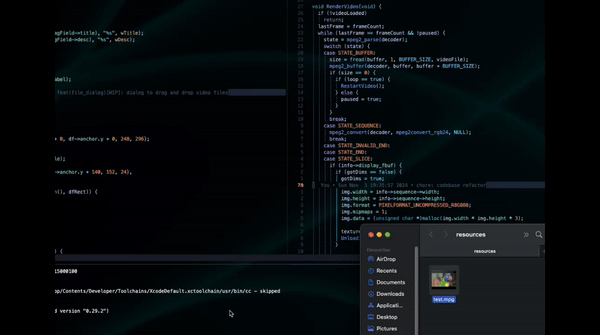
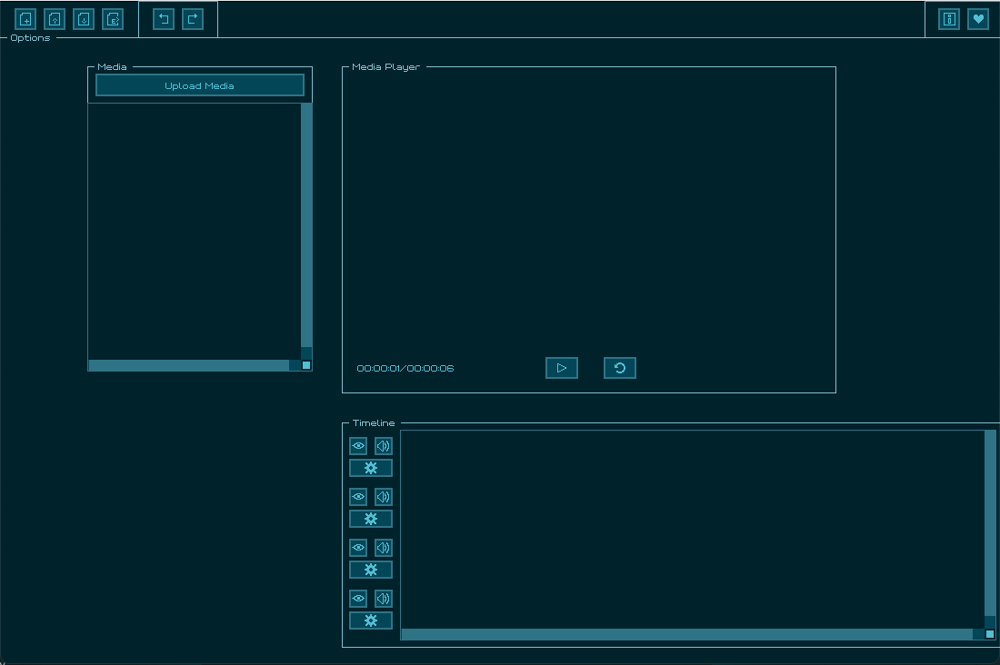

## video-editor

Creating my own basic video-editor in raylib, using ffmpeg and libmpeg2.

  

> [!IMPORTANT]
> video-editor is currently under development.
> Gif above probably doesn't reflect the current progress.
> Will update on every minor version update.

  

Tasks:

- Layout design with raygui [current]
- Upload .mpg files (drag & drop) [DONE]
- UI Components general purpose
  - Tooltip
  - Toast
- Adding and stiching existing video and decoding with libmpeg2
- Saving the editor state, so you don't lose progress after restart
- Saving the final result with ffmpeg [demo works, not implemented here yet]
- Simple manim like animation pipeline through configuration files

#### Why?

¯\_(ツ)\_/¯

I woke up one day and noticed that I can just do that.
